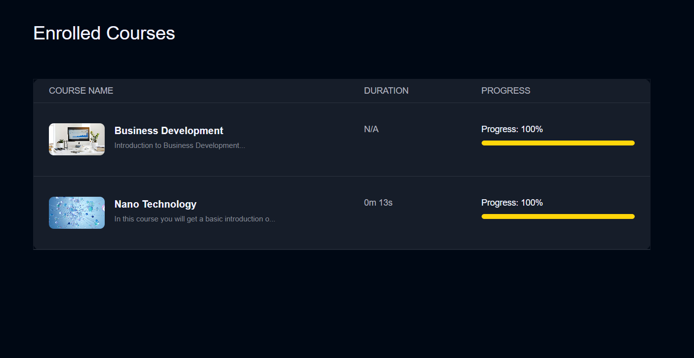
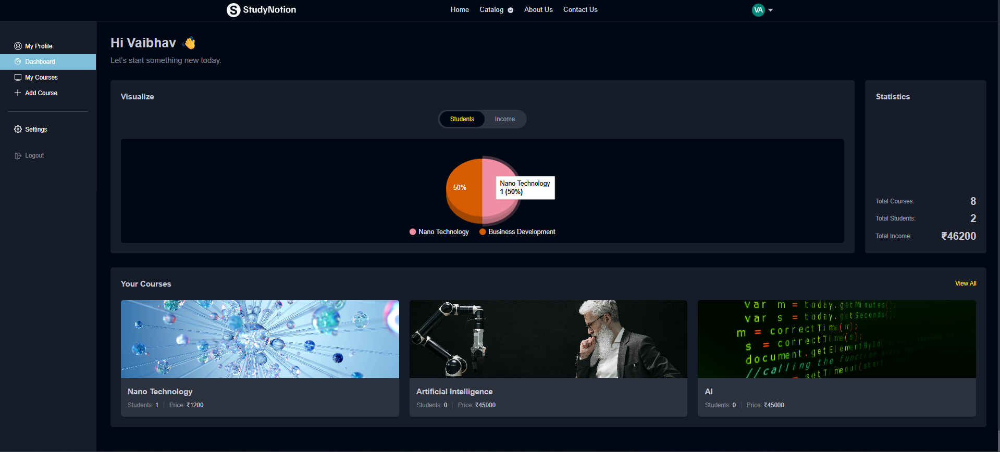

# 🎓 StudyNotion

An intuitive EdTech platform that allows students to learn and instructors to create and manage courses with ease.

---

## 🏠 Home Page

- Explore featured courses
- User authentication
- Clean and responsive design


---

## 🧑‍🎓 User Dashboard (Student)

- Track enrolled courses
- Continue learning with progress tracking
- Update profile and settings



---

## 👨‍🏫 Instructor Dashboard

- Create and manage courses
- Upload lectures and resources
- View enrolled student stats and revenue



---

## 📚 Course Details Page 

- Course overview, instructor bio
- Curriculum breakdown
- Enroll with secure Razorpay integration


---

## 🚀 Getting Started

### 1. Clone the Repo

```bash
git clone https://github.com/vaibhavrank/StudyNotion.git
